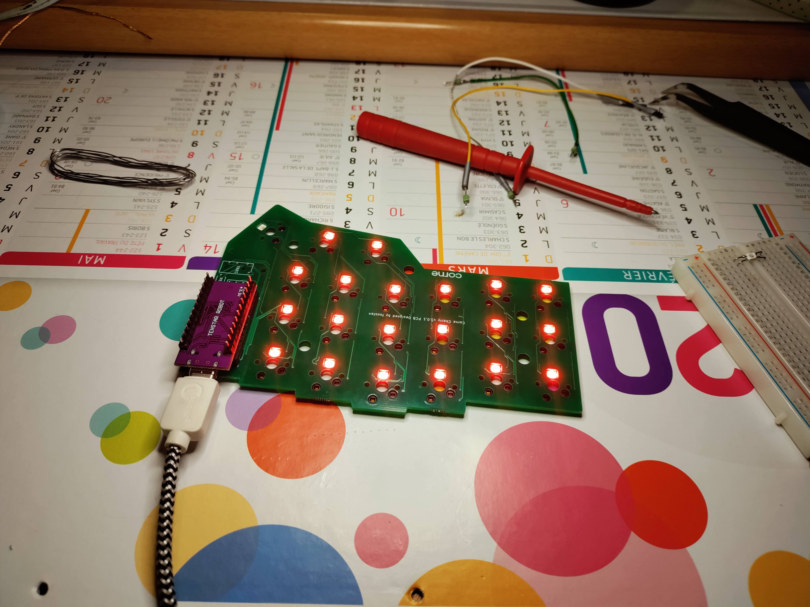
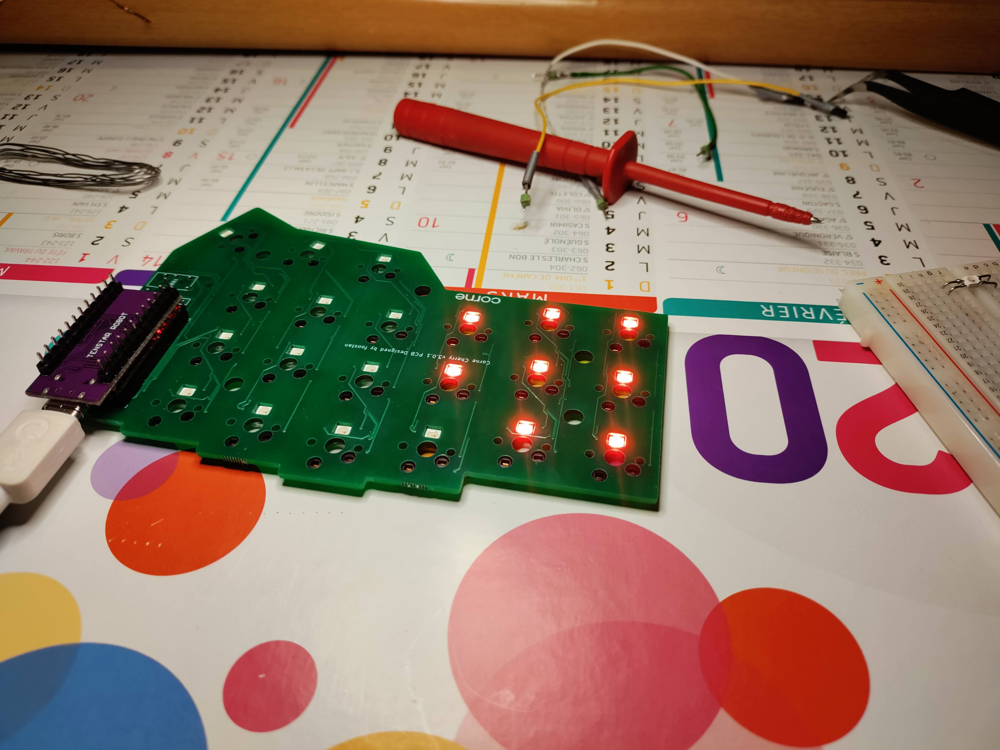

# DIY Split Mechanical Keyboard

This repository hold my any relevant files (code, CAD, etc.) I have created in my journey. A lot of resources and people have inspired me in this project I will try to keep un updated list of relevant link in this readme as well.

I have documented my journey in these articles so far:
* [Christmas Time! A Split Mechanical Keyboard, You Can Build Yourself! 🎅](https://couedeloalexandre.medium.com/christmas-time-get-a-keyboard-you-can-build-yourself-5ef27c87210c)
* [How to Build a Custom Split Mechanical Keyboard: Bill of material](https://couedeloalexandre.medium.com/how-to-build-a-custom-split-mechanical-keyboard-bill-of-material-b2cf1ab62fef?sk=5d6ce97fc56fa4b6bd173096c3c9f23f)

## Addressable LED, playing with a single LED

## Addressable LED, testing the crkbd build

